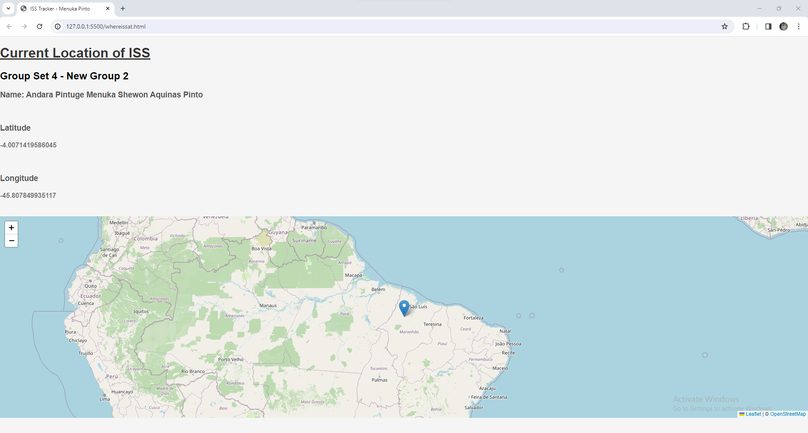

# ISS Tracker

## Module: 24W Mobile APIs and Frameworks - 01

### Group: Group Set 4 - New Group 2

### Name: Andara Pintuge Menuka Shewon Aquinas Pinto

## Project Overview

The goal of the ISS Tracker is to provide real-time tracking of the International Space Station (ISS) by capturing its exact longitude and latitude and displaying this data on a map using the Leaflet.js library.

## Leaflet.js Library

To implement the map functionality, the project utilizes the Leaflet.js library. Leaflet is a lightweight JavaScript library for interactive maps. You can find more information and the quick start guide for Leaflet.js at [https://leafletjs.com/examples/quick-start/](https://leafletjs.com/examples/quick-start/).

## Project Screenshots

### ISS Tracker

### HTML Code

### JavaScript Code

## Implementation Details

### HTML Code
The HTML code in this project is responsible for attaching the values fetched from the ISS API "https://api.wheretheiss.at/v1/satellites/25544" to the map.

### JavaScript Code
The JavaScript code handles the data fetching from the ISS API, using asynchronous functions (`async/await`). The data is then populated into two variables and used to update the map with the real-time longitude and latitude of the ISS.
